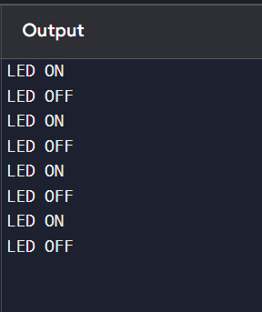

# embedded-system-simulation
Simulation of embedded system concepts including GPIO register control, bit manipulation, and real-time data processing in C.
# Embedded System Simulation in C

## Overview

This project simulates core embedded system concepts such as GPIO register control, bit manipulation, and real-time system behavior using C programming.

## Features

* Simulated GPIO register using bit manipulation
* LED ON/OFF control logic
* Real-time execution using loop and delays
* Modular embedded-style code structure

## Concepts Demonstrated

* Memory-mapped registers
* Bit masking and shifting
* Bare-metal programming concepts
* Hardware abstraction

## Output

The program simulates LED blinking behavior by manipulating virtual GPIO pins and displays output in the console.

##  Tech Stack
C Programming
Embedded Systems Concepts

* C Programming
* Embedded Systems Concepts

  ## 📸 Output Screenshot

